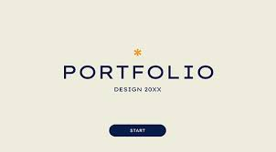

# 📁 Mon Portfolio Web Personnel

Bienvenue dans mon portfolio personnel développé en **HTML5** et **CSS3**.  
Ce site vitrine présente mes projets, mon parcours académique et professionnel ainsi que mes compétences dans le domaine du développement web et de la data science.

---

## 📸 Aperçu



---

## 📑 Contenu du projet

Le portfolio se compose des sections suivantes :

- **Home** : Page d'accueil et introduction.
- **About** : Présentation personnelle avec photo, vidéo et audio.
- **Work** : Liste de projets réalisés avec captures et vidéos.
- **Resume** : Parcours académique, expériences professionnelles et certifications.
- **Contact** : Formulaire de contact fonctionnel en HTML.


---
## 📂 Structure du projet
```bash
portfolio/
├── index.html
├── style.css
├── assets/
│   ├── images/
│   │   ├── portfolio.jpg
│   │   ├── cv.jpg
│   │   └── app_web.jpg
│   └── media/
│       └── test.mp3

```


---

## Auteur

👩‍💻 **Samah Saidi** - *Développeur Data Science*

📧 Contact: samah.saidi@polytechnicien.tn

🔗 GitHub: https://github.com/samah-saidi