📖 Git Practice — learn_git 📂
Ce projet est un petit exercice pour manipuler les commandes de base de Git : créer des fichiers, les ajouter, les valider et consulter l’historique.

```bash
learn_git/
├── third.txt (supprimé plus tard)
├── fourth.txt
├── .git/
├── README.md
├── img
```

📋 Instructions 📌
1️⃣ Créer un dossier learn_git

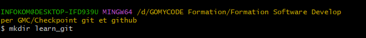

2️⃣ Se déplacer dans le dossier learn_git

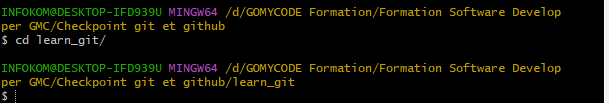

3️⃣ Créer un fichier third.txt

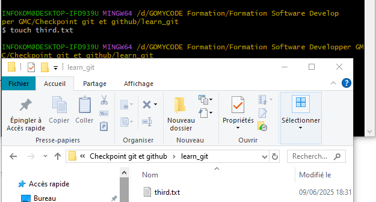

4️⃣ Initialiser un dépôt Git

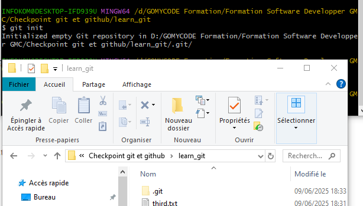

5️⃣ Ajouter third.txt à la staging area

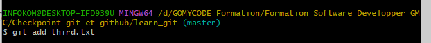

6️⃣ Faire un commit avec le message "adding third.txt"

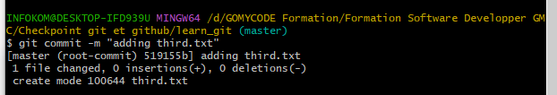

7️⃣ Afficher l’historique des commits

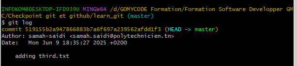

8️⃣ Créer un fichier fourth.txt

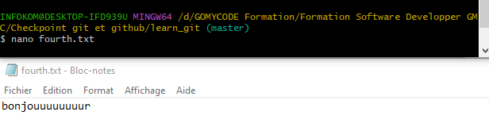

9️⃣ Ajouter fourth.txt à la staging area

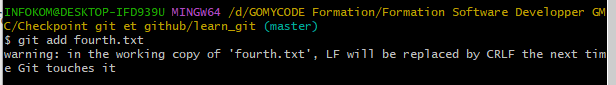

🔟 Faire un commit avec le message "adding fourth.txt"

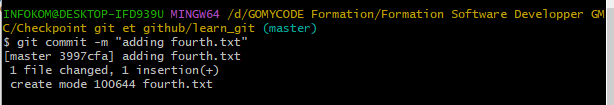

1️⃣1️⃣ Supprimer le fichier third.txt

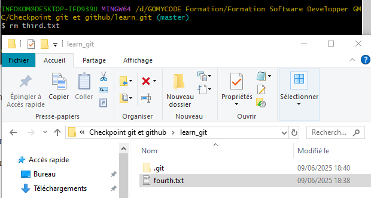

1️⃣2️⃣ Ajouter la suppression à la staging area

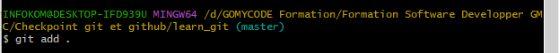

1️⃣3️⃣ Faire un commit avec le message "removing third.txt"

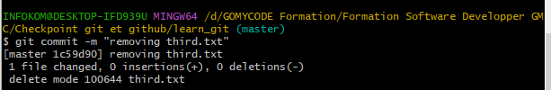

1️⃣4️⃣ Afficher à nouveau les commits

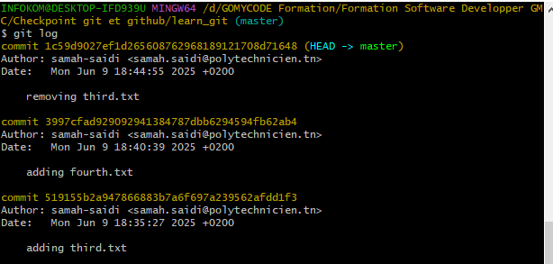

1️⃣5️⃣ Modifier la configuration globale pour que git log utilise cat comme pager

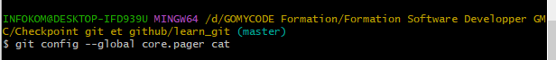

1️⃣6️⃣ Afficher toutes les configurations globales de Git

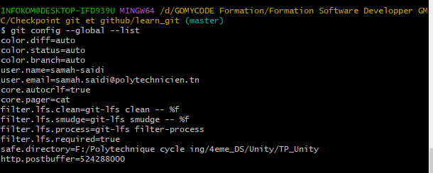

1️⃣7️⃣ Pour voir comment utiliser git config --global

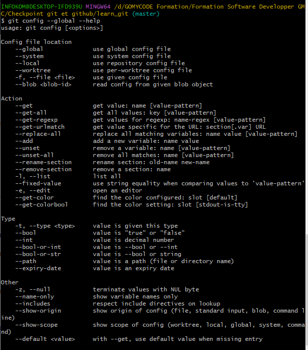

## Auteur

👩‍💻 **Samah Saidi** - *Développeur Data Science*

📧 Contact: samah.saidi@polytechnicien.tn

🔗 GitHub: https://github.com/samah-saidi