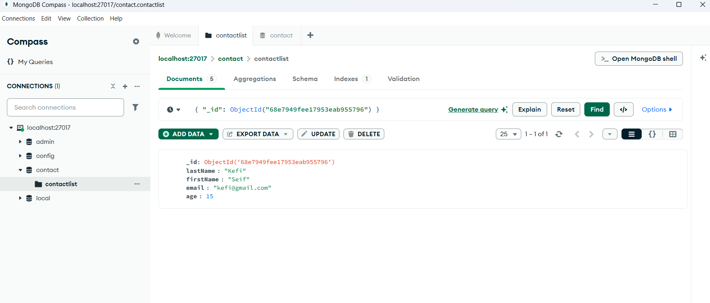
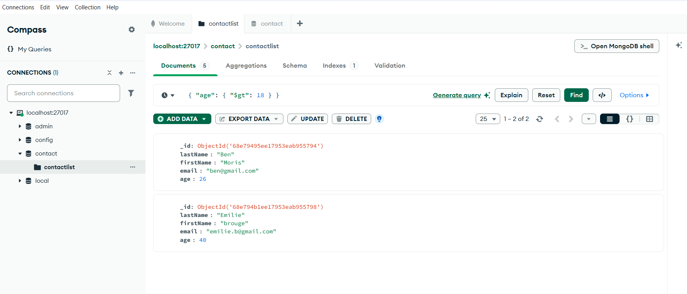
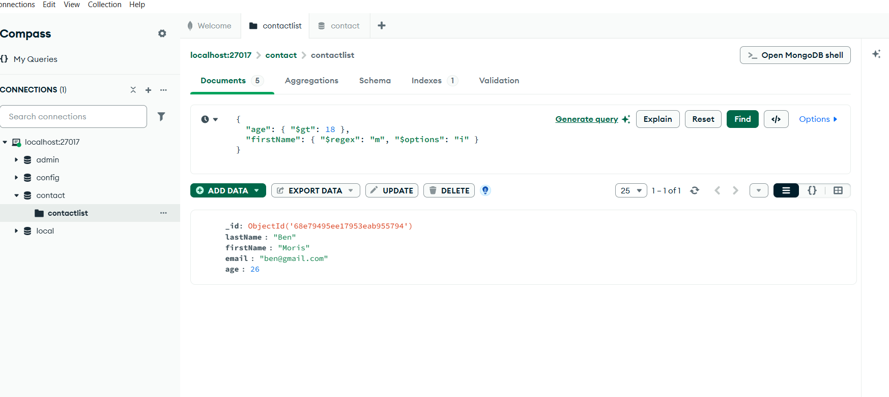
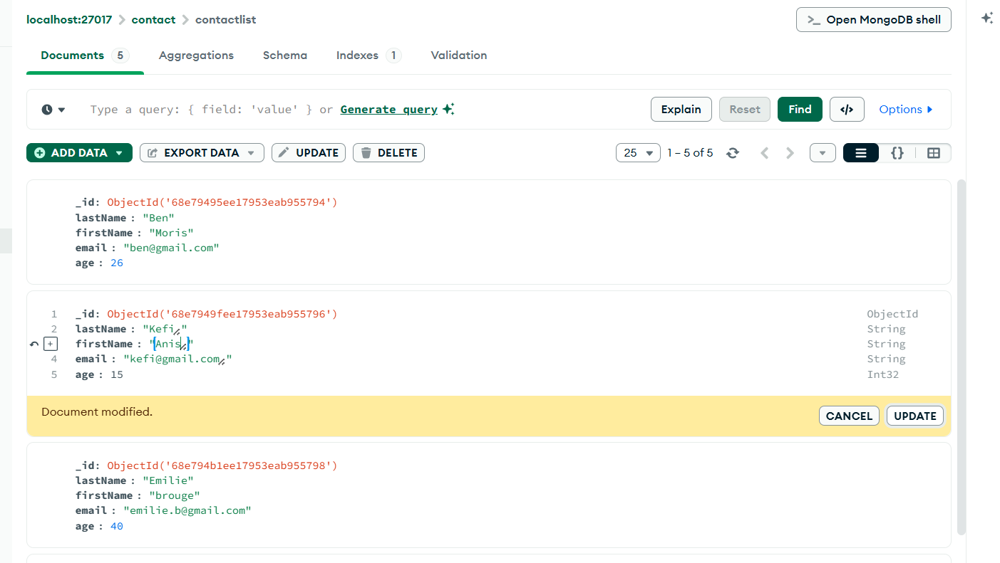
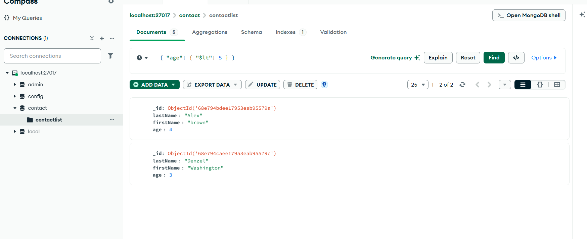
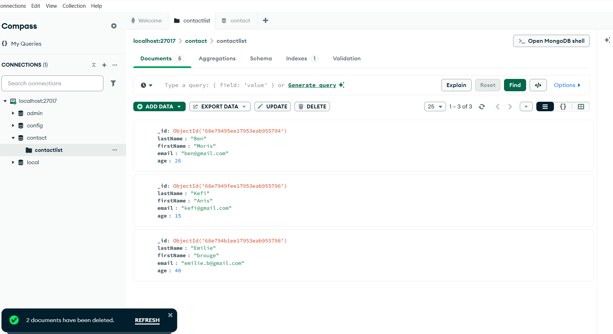

# 📇 MongoDB Contact List Checkpoint

## 📝 Description
Bienvenue dans ce projet MongoDB !  
L’objectif est de **gérer une liste de contacts** en utilisant MongoDB Compass et de pratiquer les opérations **CRUD** (Create, Read, Update, Delete).  

---

## 🗄️ Base de données et collection

- **Database:** `contact` 🏷️  
- **Collection:** `contactlist` 📋  

---

## 👥 Contacts insérés

```json
[
  { "lastName": "Ben", "firstName": "Moris", "email": "ben@gmail.com", "age": 26 },
  { "lastName": "Kefi", "firstName": "Seif", "email": "kefi@gmail.com", "age": 15 },
  { "lastName": "Emilie", "firstName": "brouge", "email": "emilie.b@gmail.com", "age": 40 },
  { "lastName": "Alex", "firstName": "brown", "age": 4 },
  { "lastName": "Denzel", "firstName": "Washington", "age": 3 }
]
```
## 🔧 Étapes réalisées

1. Afficher tous les contacts 👀

  * Filtre vide {} pour voir toute la liste.

2. Afficher un contact par _id 🆔

  * Exemple de filtre :

```json
{ "_id": ObjectId("ID_DU_CONTACT") }
```



3. Afficher les contacts avec age > 18 🎂

  * Filtre :

```json
{ "age": { "$gt": 18 } }
```


4. Afficher les contacts avec age > 18 et prénom contenant "ah" 🔍

  *Filtre :
```json
{ 
  "age": { "$gt": 18 },
  "firstName": { "$regex": "ah", "$options": "i" } 
}
```


5. Modifier le prénom de "Seif" en "Anis" ✏️

  * Sélection du document → Edit → Update.



6. Supprimer les contacts âgés de moins de 5 ans 🗑️

  * Filtre :
```json
{ "age": { "$lt": 5 } }
```



7. Afficher la liste finale des contacts ✅

  * Filtre vide {} pour vérifier les changements.




## 🛠️ Outils utilisés

MongoDB Compass 🖥️ : pour visualiser et manipuler les documents.

MongoDB 💾 : version locale ou serveur distant.