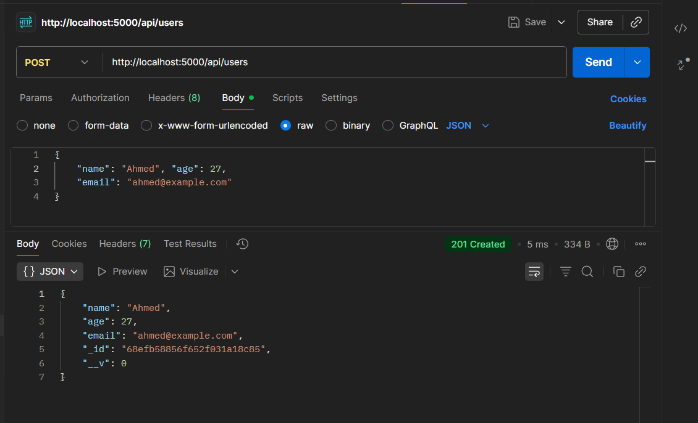
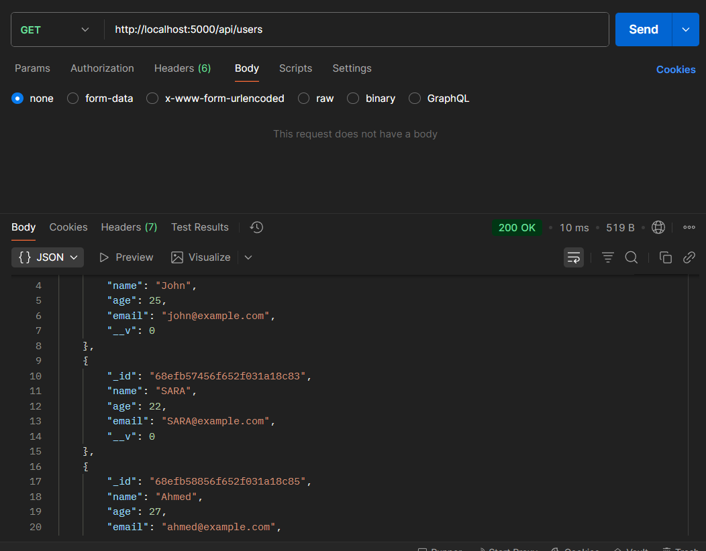
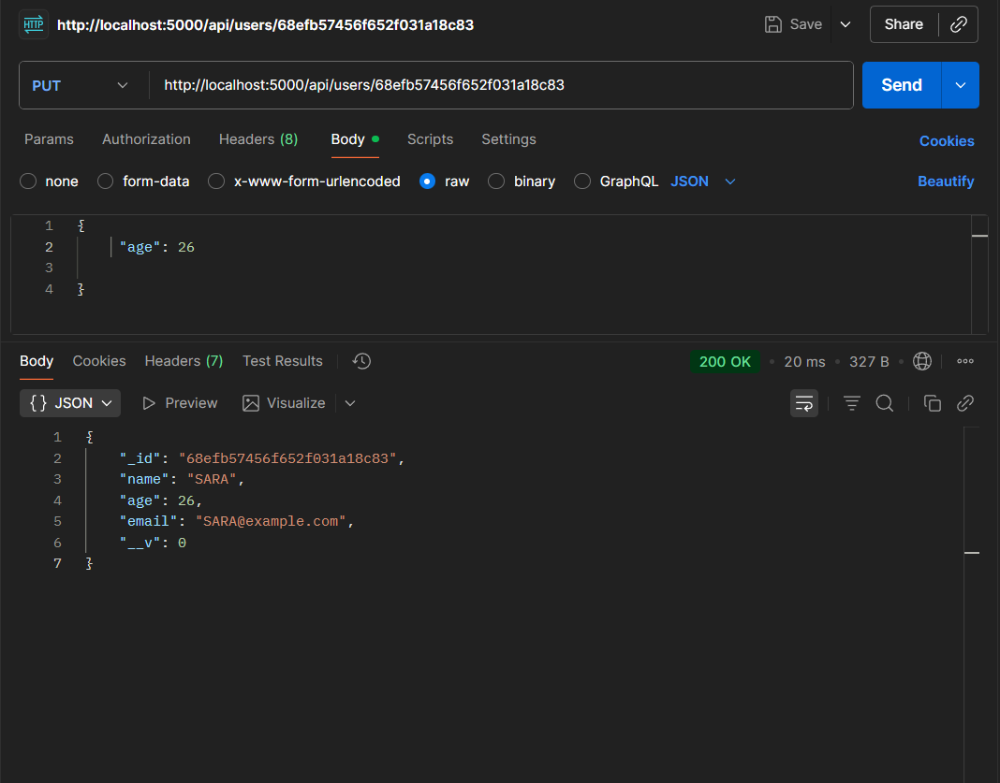
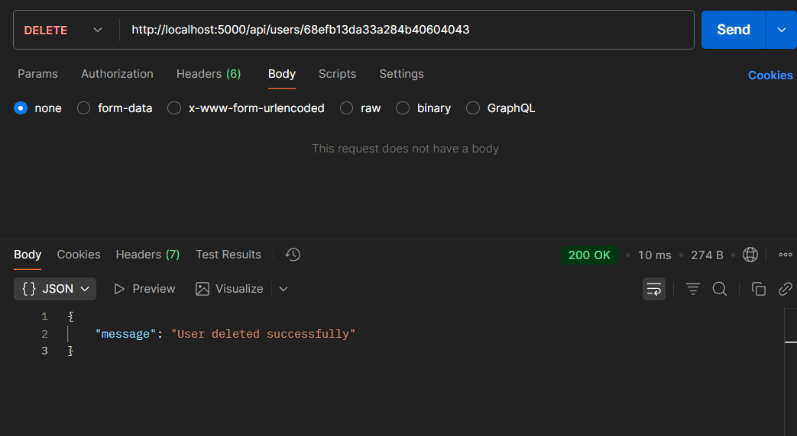

# 📝 Checkpoint REST API

Projet Node.js pour créer une REST API avec Express, Mongoose et MongoDB, permettant de gérer des utilisateurs (CRUD).

## 🚀 Fonctionnalités

🔹 GET /api/users : Récupérer tous les utilisateurs

🔹 POST /api/users : Ajouter un nouvel utilisateur

🔹 PUT /api/users/:id : Modifier un utilisateur par ID

🔹 DELETE /api/users/:id : Supprimer un utilisateur par ID

✅ Connexion à MongoDB local ou Atlas

✅ Utilisation de .env pour la configuration

✅ Testable avec Postman

## 🗂 Structure du projet
```bash
checkpoint-REST-API/
│
├── config/
│   └── .env          # Variables d'environnement
│
├── models/
│   └── User.js       # Modèle Mongoose
│
├── package.json
└── server.js         # Serveur Express principal
```

## ⚡ Installation et lancement

##### 1️⃣ Cloner le projet ou créer un nouveau dossier :
```bash
mkdir checkpoint-REST-API
cd checkpoint-REST-API
npm init -y
```

###### 2️⃣ Installer les dépendances :
```bash
npm install express mongoose dotenv
```

##### 3️⃣ Créer le fichier .env dans config/ :
```bash
PORT=5000
MONGO_URI=mongodb://localhost:27017/checkpoint_api
```

💡 Pour MongoDB Atlas, remplacer MONGO_URI par le lien fourni par Atlas.

##### 4️⃣ Lancer le serveur :
```bash
npm run dev 
```

🌐 Le serveur tourne sur http://localhost:5000

## 🛠 Code du projet
1️⃣ models/User.js
```js
// Import de mongoose
const mongoose = require('mongoose');

// Définition du schéma utilisateur
const userSchema = new mongoose.Schema({
  name: { type: String, required: true },
  age: Number,
  email: { type: String, required: true, unique: true }
});

// Export du modèle
module.exports = mongoose.model('User', userSchema);
```
2️⃣ server.js
```js
// Import des modules nécessaires
const express = require('express');
const mongoose = require('mongoose');
const dotenv = require('dotenv');

// Charger les variables d'environnement
dotenv.config({ path: './config/.env' });

// Initialisation d'Express
const app = express();

// Middleware pour parser le JSON
app.use(express.json());

// Import du modèle User
const User = require('./models/User');

// Connexion à MongoDB
mongoose.connect(process.env.MONGO_URI)
  .then(() => console.log('✅ MongoDB Connected'))
  .catch(err => console.error('❌ Database connection error:', err));

// ---------------- ROUTES ----------------

// GET : Retourner tous les utilisateurs
app.get('/api/users', async (req, res) => {
  try {
    const users = await User.find();
    res.json(users);
  } catch (err) {
    res.status(500).json({ message: err.message });
  }
});

// POST : Ajouter un nouvel utilisateur
app.post('/api/users', async (req, res) => {
  try {
    const newUser = new User(req.body);
    await newUser.save();
    res.status(201).json(newUser);
  } catch (err) {
    res.status(400).json({ message: err.message });
  }
});

// PUT : Modifier un utilisateur par ID
app.put('/api/users/:id', async (req, res) => {
  try {
    const updatedUser = await User.findByIdAndUpdate(
      req.params.id,
      req.body,
      { new: true } // retourne la nouvelle version
    );
    res.json(updatedUser);
  } catch (err) {
    res.status(400).json({ message: err.message });
  }
});

// DELETE : Supprimer un utilisateur par ID
app.delete('/api/users/:id', async (req, res) => {
  try {
    await User.findByIdAndDelete(req.params.id);
    res.json({ message: '🗑️ User deleted successfully' });
  } catch (err) {
    res.status(500).json({ message: err.message });
  }
});

// ----------------------------------------

// Démarrage du serveur
const PORT = process.env.PORT || 5000;
app.listen(PORT, () => console.log(`🚀 Server running on port ${PORT}`));
``` 

## 🔧 Test avec Postman

| Méthode | Endpoint          | Description                 | Exemple JSON corps                                      |
|---------|-----------------|-----------------------------|--------------------------------------------------------|
| GET     | /api/users       | Retourne tous les utilisateurs | —                                                      |
| POST    | /api/users       | Ajouter un utilisateur       | `{ "name": "John", "age": 25, "email": "john@example.com" }` |
| PUT     | /api/users/:id   | Modifier un utilisateur      | `{ "age": 30 }`                                       |
| DELETE  | /api/users/:id   | Supprimer un utilisateur     | —                                                      |

1️⃣ POST /api/users – Ajouter un nouvel utilisateur

Méthode : POST

Endpoint : http://localhost:5000/api/users

Headers : Content-Type: application/json

Corps JSON :
```json
{
  "name": "Ahmed",
  "age": 27,
  "email": "ahmed@example.com"
}
```
Exemple de réponse :



2️⃣ GET /api/users – Récupérer tous les utilisateurs

Méthode : GET

Endpoint : http://localhost:5000/api/users

Corps : Aucun

Exemple de réponse :


3️⃣ PUT /api/users/:id – Modifier un utilisateur

Méthode : PUT

Endpoint : http://localhost:5000/api/users/68efb57456f652f031a18c83

Headers : Content-Type: application/json

Corps JSON :
```json
{
  "age": 26
}
```
Exemple de réponse :



4️⃣ DELETE /api/users/:id – Supprimer un utilisateur

Méthode : DELETE

Endpoint : http://localhost:5000/api/users/68efb13da33a284b40604043

Corps : Aucun

Exemple de réponse :




### 📚 Ressources utiles

.env

Express.js

Mongoose

REST API Basics

### 🎉 Conclusion

Ce projet met en pratique :

La création d’une REST API avec Node.js et Express

La connexion à MongoDB avec Mongoose

Les opérations CRUD sur des utilisateurs

L’utilisation des variables d’environnement