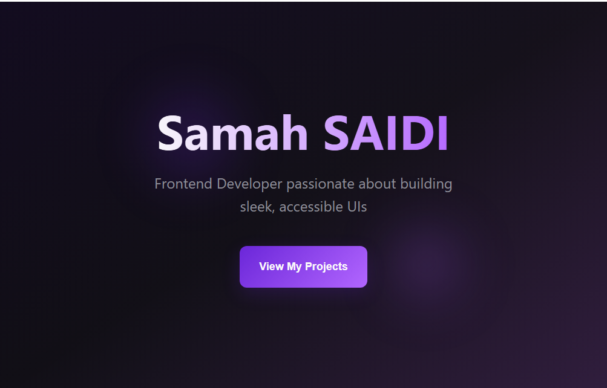

# Foundations of AI-Powered Vibe Coding – Checkpoint Submission

## 💻 Project Overview

This is my submission for the **"Foundations of AI-Powered Vibe Coding"** checkpoint.  
The task was to create a one-section personal landing page using **Lovable AI** and perform one manual improvement.

## 🎯 What’s Included

- A hero header featuring:
  - My **name**
  - A **subtitle** describing my frontend developer goals
  - A **"View My Projects"** button
- Custom layout and color theme designed using Lovable's UI tools
- One manual improvement in code:  
  _[e.g., custom font added or spacing modified in CSS]_

## 🛠 Manual Improvement Made

I modified the CSS manually to:
> ✨ _[e.g., change the font to "Inter" and added `padding: 40px` to the hero section for better visual spacing]_.

## 📸 Screenshot



## 📂 Project Structure

```bash
AI_Powered_Vibe_Coding_Checkpoint/
├── index.html # Final exported and manually edited landing page
├── result.png # Screenshot of the rendered page in browser
└── README.md # Project documentation (this file)
```
## 📁 Files Included

- `index.html` – Exported and manually edited HTML file
- `result.png` – Screenshot of the final landing page
- `README.md` – Description and documentation for this checkpoint
