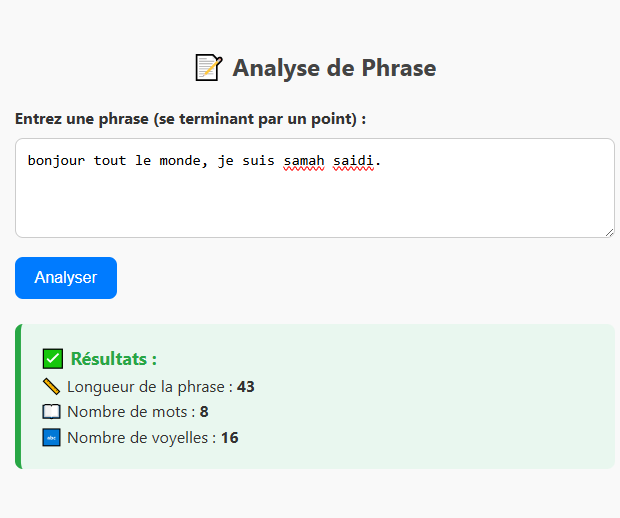

# 📑 Analyse de Phrase

Ce projet est une petite application web interactive qui permet d'analyser une phrase saisie par l'utilisateur et d'afficher :

- 📏 La longueur de la phrase (en nombre de caractères avant le point `.`)
- 📖 Le nombre de mots (séparés par des espaces)
- 🔤 Le nombre de voyelles présentes dans la phrase

---

## 🌐 Aperçu du résultat

Voici un aperçu de l'interface et des résultats :



---

## 🚀 Fonctionnalités

- Lecture d'une phrase caractère par caractère jusqu'au point final `.`
- Calcul de :
  - 📏 Longueur de la phrase
  - 📖 Nombre de mots
  - 🔤 Nombre de voyelles
- Affichage des résultats dans un encadré stylisé
- Interface responsive et design épuré avec CSS personnalisé
- Utilisation d'icônes et couleurs pour un rendu plus agréable

---

## 📦 Structure du projet
```bash
📁 AnalysePhrase/
├── index.html
├── resultat.png
└── README.md
```

---

## Auteur

👩‍💻 **Samah Saidi** - *Développeur Data Science*

📧 Contact: samah.saidi@polytechnicien.tn

🔗 GitHub: https://github.com/samah-saidi


