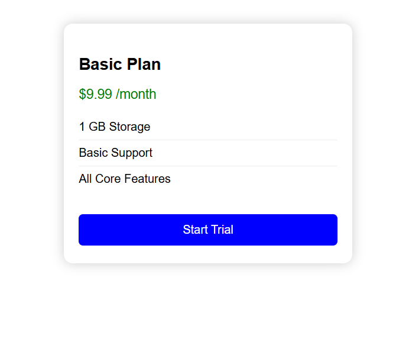
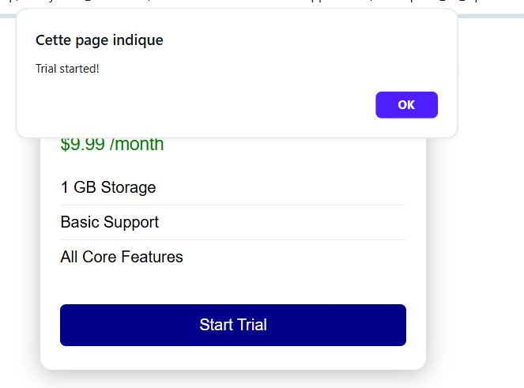

# 🚀 Pricing Card Refactor – Checkpoint BP Optimization AI

## 📝 Description
Ce projet consiste à corriger, refactorer et rendre réutilisable un composant web de carte de tarification (pricing card) fourni initialement avec des bugs de mise en page et de responsivité. L'objectif est d'obtenir un composant moderne, responsive et facilement réutilisable via JavaScript.

## 🐞 Problèmes initiaux
- ❌ Propriété CSS erronée : `box-shdow` au lieu de `box-shadow`
- ❌ Balise `<h2>` non fermée correctement
- ❌ Largeur fixe, non responsive
- ❌ Bouton non interactif

## 🛠️ Correction et refactorisation
- ✅ Correction des bugs de syntaxe HTML/CSS
- ✅ Ajout de la responsivité (media queries)
- ✅ Refactorisation en composant réutilisable via une fonction JavaScript
- ✅ Ajout d'un exemple d'utilisation dynamique

## ⏪ Avant (code d'origine)
```html
<!DOCTYPE html>
<html>
<head>
<style>
.pricing {
width: 300px;
margin: auto;
background-color: #fff;
box-shdow: 0 0 10px #ccc;
padding: 10px;
text-align: left;
}

.title {
font-size: 22px;
font-weight: bold;
}

.price {
font-size: 18px;
color: green;
}

.features {
list-style: none;
padding-left: 0;
}

.features li {
padding: 4px;
border-bottom: 1px solid #eee;
}

.btn {
background: blue;
color: white;
padding: 10px 20px;
border: none;
margin-top: 10px;
}

.btn:hover {
background: darkblue;
}
</style>
</head>
<body>

<div class="pricing">
<h2 class="title">Basic Plan<h2>
<p class="price">$9.99 /month</p>

<ul class="features">
<li>1 GB Storage</li>
<li>Basic Support</li>
<li>All Core Features</li>
</ul>

<button class="btn">Start Trial</button>
</div>

</body>
</html>
```

## ⏩ Après (composant refactorisé)
Voir le fichier `pricing-card.html` pour le code complet.

🔹 **Extrait principal :**
```html
<div id="cards-container"></div>
<script>
function createPricingCard({ title, price, features, buttonText, onButtonClick }) {
  const card = document.createElement('div');
  card.className = 'pricing-card';
  card.innerHTML = `
    <h2 class="pricing-title">${title}</h2>
    <p class="pricing-price">${price}</p>
    <ul class="pricing-features">
      ${features.map(f => `<li>${f}</li>`).join('')}
    </ul>
    <button class="pricing-btn">${buttonText}</button>
  `;
  const btn = card.querySelector('.pricing-btn');
  if (onButtonClick) btn.addEventListener('click', onButtonClick);
  return card;
}
// Exemple d'utilisation
const cardData = {
  title: 'Basic Plan',
  price: '$9.99 /month',
  features: ['1 GB Storage', 'Basic Support', 'All Core Features'],
  buttonText: 'Start Trial',
  onButtonClick: () => alert('Trial started!')
};
document.getElementById('cards-container').appendChild(createPricingCard(cardData));
</script>
```

### 🖼️ Résultat visuel


|---------|--------|
|  |  |

## 🧪 Tester le composant
1. 🖥️ Ouvrez `pricing-card.html` dans votre navigateur.
2. 📱 Le composant s'affiche de façon responsive et le bouton est interactif.
3. 🛠️ Modifiez les données dans le script pour générer d'autres cartes si besoin.

## 🤖 Prompt AI utilisé
> Refactor this broken pricing card HTML/CSS into a reusable, responsive component. Fix all layout and syntax bugs, improve mobile responsiveness, and make the card reusable via a JavaScript function (Card(title, price, features)).

## 👩‍💻 Auteur

Samah Saidi - Développeur Data Science

📧 Contact: samah.saidi@polytechnicien.tn

🔗 GitHub: https://github.com/samah-saidi