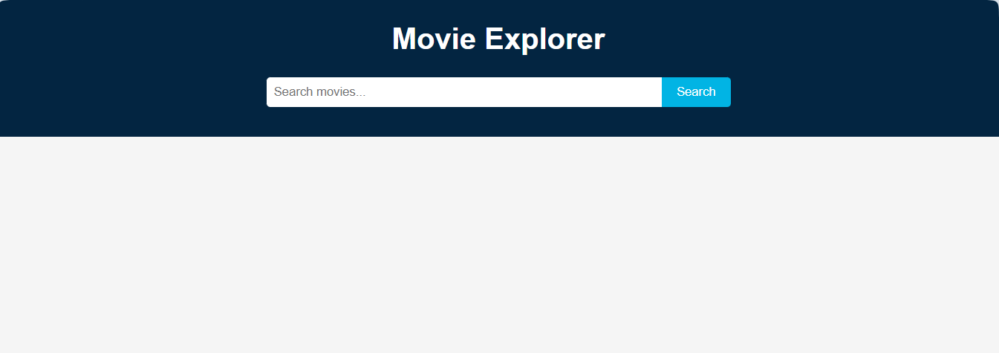

# Movie Explorer

Movie Explorer is a simple web application that allows users to discover and search for movies using The Movie Database (TMDb) API. The app displays popular movies on load and lets users search for any movie by title, showing results as interactive cards with posters, ratings, and overviews.

## Features 

- Browse popular movies with poster images, ratings, and overviews
- Search for movies by title
- Responsive UI with interactive movie cards
- Color-coded ratings for quick visual feedback

 

## Getting Started

### Prerequisites
- A modern web browser
- A TMDb API key ([get one here](https://www.themoviedb.org/documentation/api))

### Setup
1. Clone the repository:
   ```bash
   git clone https://github.com/samah-saidi/Formation-Software-Developper-GMC/tree/main/Checkpoint_Final_Project_AI
   cd Checkpoint_Final_Project_AI
   ```
2. Open `app.js` and replace `'YOUR_TMDB_API_KEY'` with your actual TMDb API key.
3. Open `index.html` in your browser to use the app locally.

## Deployment
This app can be deployed easily using GitHub Pages:
1. Push your code to a GitHub repository.
2. In your repo, go to **Settings > Pages**.
3. Set the source branch to `main` (or `master`) and the root folder.
4. Save and visit the provided URL to see your deployed app.

## Project Structure
```
├── index.html        # Main HTML file
├── styles.css        # App styles
├── app.js            # Main JavaScript logic
└── README.md         # Project documentation
```

## Credits

- [TMDb API](https://www.themoviedb.org/documentation/api) for movie data
- UI inspired by modern movie apps

## Auteur

👩‍💻 Samah Saidi - Développeur Data Science

📧 Contact: samah.saidi@polytechnicien.tn

🔗 GitHub: https://github.com/samah-saidi