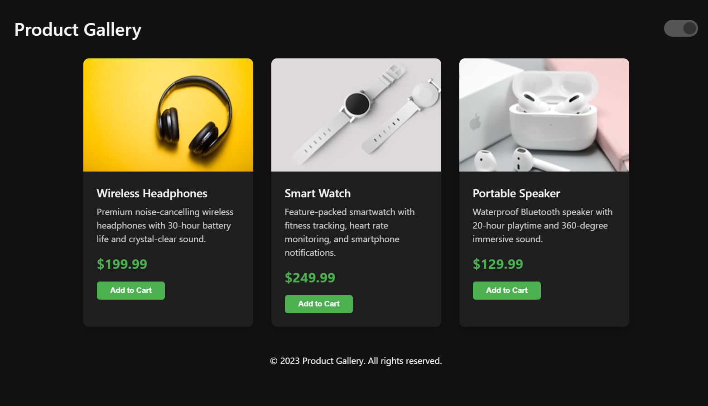
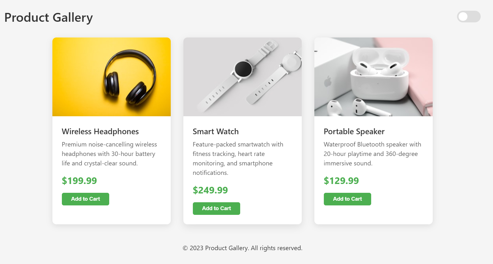

# 📸 Product Gallery Showcase - Light/Dark Mode Toggle

Une galerie produit élégante avec mode clair/sombre et animations fluides, développée en pur HTML/CSS/JS.





# ✨ Features

3 Beautiful Product Cards showcasing different tech gadgets

Smooth Hover Animations with subtle elevation and image zoom effects

Theme Toggle between light and dark modes

CSS Animations with sequenced fade-in effects

Fully Responsive design that works on all devices

Local Storage remembers user's theme preference

Pure Vanilla JS - No frameworks or libraries needed

# 🛠️ Technologies Used

HTML5 semantic markup

CSS3 with custom properties (variables)

Vanilla JavaScript

CSS animations and transitions

Flexbox layout

Media queries for responsiveness

# 🎨 Design Highlights

Clean, modern card design

Subtle shadows and rounded corners

Consistent color scheme with accent colors

Perfectly sized product images (300x200px)

Smooth transitions between themes

# 🚀 How to Use
Clone the repository

Open index.html in your browser

Click the toggle switch to change themes

Hover over cards to see the animations

# 🌟 Special Features
Respects system color scheme preferences

Sequential card animations for visual interest

Accessible toggle button with ARIA label

Optimized image loading

# 📝 Code Structure
```bash
Checpoint_Layout-Int-AI
├── index.html          # Main HTML file / CSS / JS
├── README.md
├── result.png          # Screenshot of the gallery
└── result1.png          # Screenshot of the gallery
```

# 💡 Customization Tips

Change colors by modifying the CSS variables

Add more cards by duplicating the article element

Adjust animation timings in the @keyframes rules

Replace product images with your own

# 📱 Responsive Design
The gallery automatically adjusts to:

Mobile phones (stacked layout)

Tablets (2-column layout)

Desktops (3-column layout)

## Auteur

👩‍💻 Samah Saidi - Développeur Data Science

📧 Contact: samah.saidi@polytechnicien.tn

🔗 GitHub: https://github.com/samah-saidi