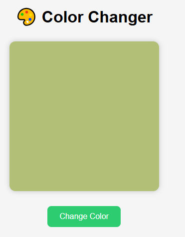
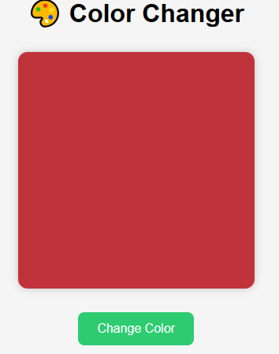
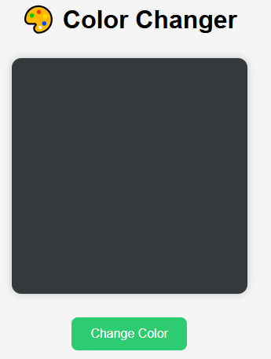
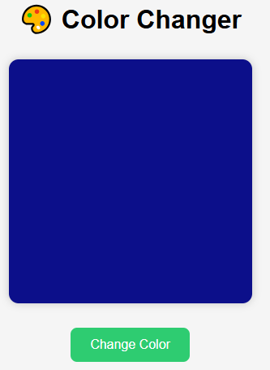

# 🎨 Color Changer — DOM Project 2

> Un mini-projet interactif en JavaScript DOM qui permet de changer la couleur d’un carré en cliquant sur un bouton.

---

## 📸 Aperçu






---

## 📚 Fonctionnalités

✅ Un carré coloré affiché au centre de la page  
✅ Un bouton "Change Color"  
✅ À chaque clic sur le bouton, le carré change dynamiquement de couleur aléatoire  
✅ Effet de transition fluide pour le changement de couleur  

---

## 📂 Structure du projet
```bash
/DOM_Project2
├── index.html
├── style.css
└── script.js
```
## 🚀 Comment exécuter le projet

1. 📥 Télécharger ou cloner le dépôt :
   ```bash
   git clone https://github.com/samah-saidi/Formation-Software-Developper-GMC/tree/main/DOM_Project2


---

## Auteur

👩‍💻 **Samah Saidi** - *Développeur Data Science*

📧 Contact: samah.saidi@polytechnicien.tn

🔗 GitHub: https://github.com/samah-saidi

