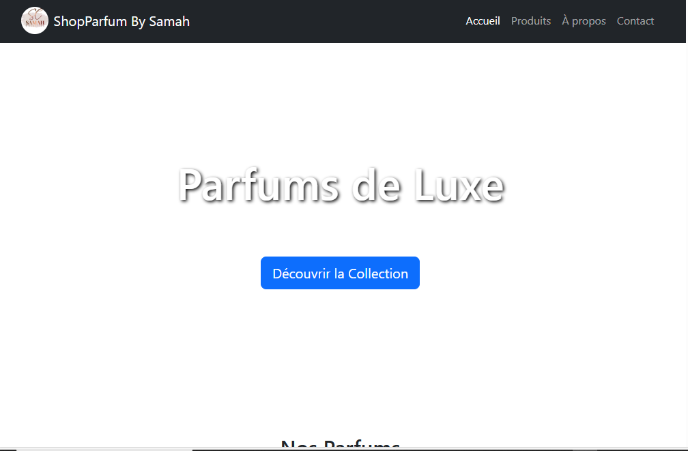
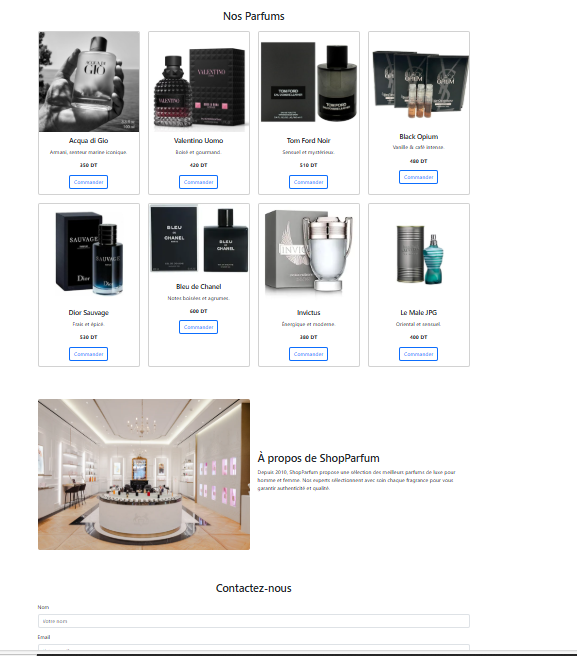

# 🌸 ShopParfum By Samah — E-Commerce Parfums (Bootstrap)

Bienvenue sur **ShopParfum By Samah**, un site e-commerce vitrine de vente de parfums de luxe, réalisé en **HTML5**, **CSS3**, et **Bootstrap 5.3**.  
Ce projet présente un site responsive avec catalogue de produits, page d'accueil, formulaire de contact et informations sur la boutique.

---

## 📸 Aperçu

---

## 🎨 Fonctionnalités

✅ Hero section avec image de fond et slogan  
✅ Navbar avec logo et navigation fluide  
✅ Catalogue de 8 parfums avec images, prix et bouton "Commander"  
✅ Section "À propos de nous" en deux colonnes  
✅ Formulaire de contact  
✅ Footer avec liens vers les réseaux sociaux  
✅ Design responsive via Bootstrap Grid System  

---

## 🛠️ Technologies utilisées

- HTML5
- CSS3
- Bootstrap 5.3 CDN
- Images hébergées (Sephora / ParfumIdéal / Chanel / Unsplash)

---

## Auteur

👩‍💻 **Samah Saidi** - *Développeur Data Science*

📧 Contact: samah.saidi@polytechnicien.tn

🔗 GitHub: https://github.com/samah-saidi

