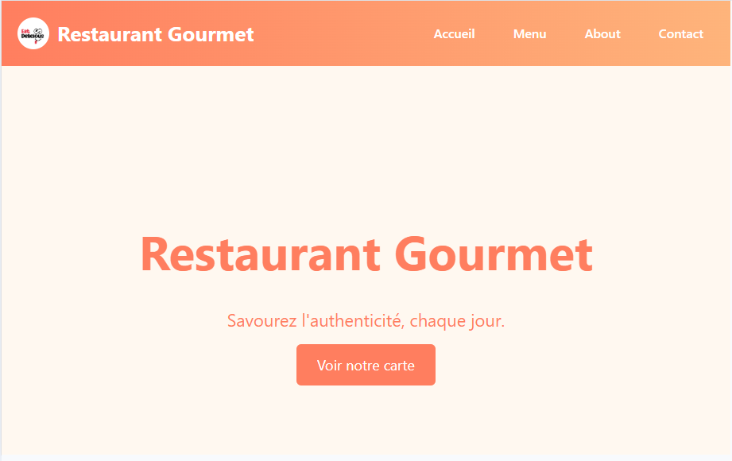
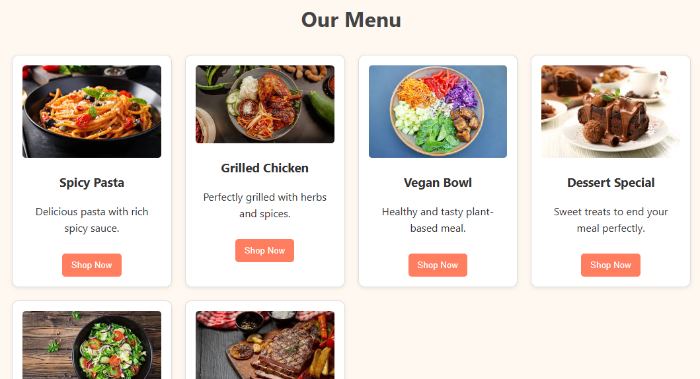
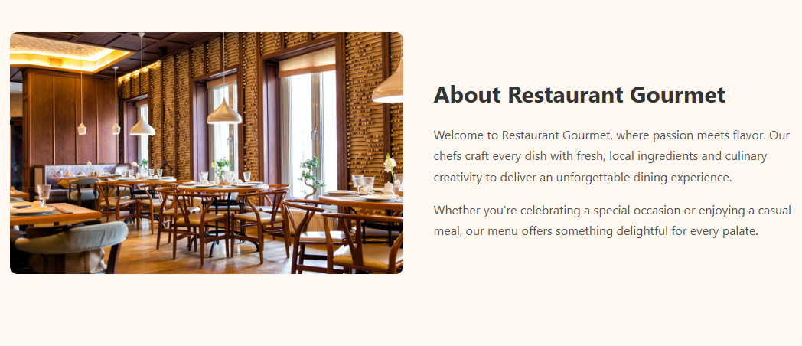
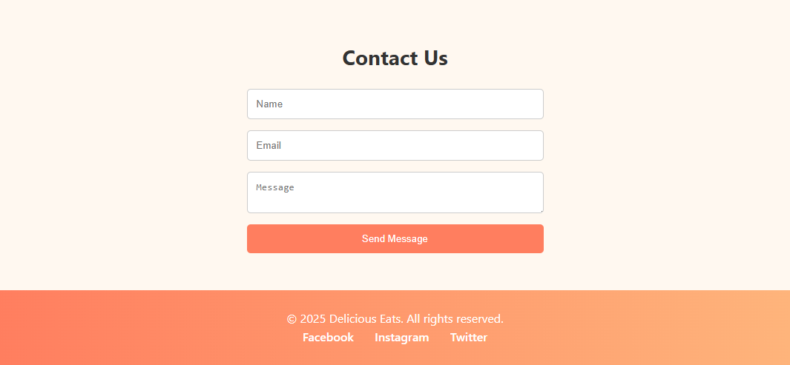

# 🍽️ Restaurant Gourmet — Responsive Landing Page

Bienvenue sur le projet **Restaurant Gourmet**, une landing page responsive et moderne pour un restaurant gastronomique, réalisée en HTML et CSS.  

---

## Structure de projet

```bash
/Website_Rrestaurant/
│
├── index.html
├── style.css
├── /images/
└── README.md
```
---

## 📸 Aperçu du site

# Page d'accueil 

  

# Section Menu 

  

# Section About 
  

# Section Contact 

  

---

## 📑 Fonctionnalités  

- ✅ Navbar dégradée avec logo et liens cliquables  
- ✅ Hero section avec image de fond et appel à l'action  
- ✅ Section **Menu** avec des cartes produits élégantes  
- ✅ Section **About** avec image et description responsive  
- ✅ Formulaire de contact  
- ✅ Footer en dégradé avec liens réseaux sociaux  
- ✅ Design entièrement responsive (mobile / tablette / desktop)  

---

## 🛠️ Technologies utilisées

- HTML5  
- CSS3 (Flexbox, Grid, Media Queries)  
- Aucune librairie externe (option d'ajout de Bootstrap ou Tailwind possible)

---


## 🚀 Installation et utilisation  

1. **Cloner le projet :**

```bash
git clone https://github.com/samah-saidi/Formation-Software-Developper-GMC/tree/main/Website_Restaurant
```

📱 Responsive Design
Le site s'adapte parfaitement aux écrans :

📱 Smartphone

💻 Desktop

📺 Tablette

Grâce à l'utilisation de flexbox, grid et media queries bien configurés.

---

## Auteur

👩‍💻 **Samah Saidi** - *Développeur Data Science*

📧 Contact: samah.saidi@polytechnicien.tn

🔗 GitHub: https://github.com/samah-saidi


