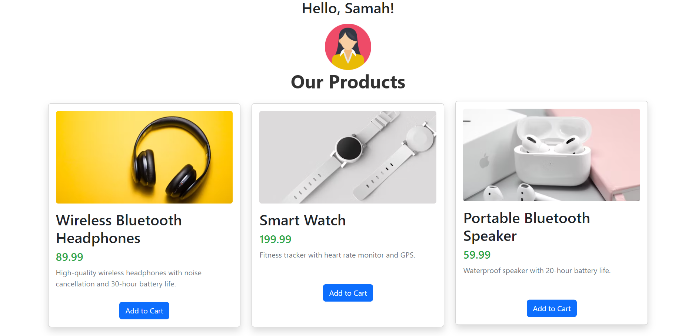

## 🛍️ React Product Card Checkpoint

Bienvenue dans ce projet React 🎯 ! Ce mini-projet a pour but de mettre en pratique vos compétences en JSX, React Components, et React-Bootstrap 💡.

## 🚀 Objectif

Créer une carte produit stylée à l’aide de composants React réutilisables.

✅ Ce que vous allez pratiquer :

Utilisation de create-react-app

Création de composants React (Name, Price, Description, Image)

Manipulation de données via un objet JSON

Utilisation de React-Bootstrap pour styliser vos composants

Affichage conditionnel dynamique avec JSX

## 🧱 Structure du projet

```bash 
jsx-react-comp-checkpoint/
├── src/
│   ├── App.js              // Composant racine
│   ├── App.css             // Fichier de styles personnalisés
│   ├── Product.js          // Objet JSON du produit
│   ├── components/
│   │   ├── Name.js         // Affiche le nom du produit
│   │   ├── Price.js        // Affiche le prix
│   │   ├── Description.js  // Affiche la description
│   │   └── Image.js        // Affiche l’image
│   └── image/
│       └── result.png      // Capture d’écran du rendu final
└── README.md
```

## 📦 Installation

Clonez le repo :

```bash
git clone <url-du-repo>
cd jsx-react-comp-checkpoint
```

Installez les dépendances :

```bash

npm install
```

Démarrez l’application :

```bash
npm start
```
## 🎯 Résultat attendu

Voici un aperçu du rendu final :



📌 Chaque carte contient :

Le nom du produit

Le prix

Une description

Une image

👋 En dessous de la carte : un message personnalisé

Si un prénom est défini → “Hello, Prénom” + une image 🎉

Sinon → “Hello, there!”

 ✍️ Personnalisation

Pour modifier les données : éditez src/Product.js

Pour ajuster le style : modifiez App.css ou utilisez les classes Bootstrap

Soyez créatif avec la mise en page et les couleurs 🎨

## 📚 Technologies utilisées

React

React-Bootstrap

JSX

CSS

## 📌 Remarque

Ce projet est réalisé dans le cadre d’un checkpoint JSX et React Components. N'hésitez pas à ajouter d'autres produits, animations, ou effets visuels pour le rendre unique ! ✨

## 👩‍💻 Auteur

Samah Saidi - Développeur Data Science

📧 Contact: samah.saidi@polytechnicien.tn

🔗 GitHub: https://github.com/samah-saidi