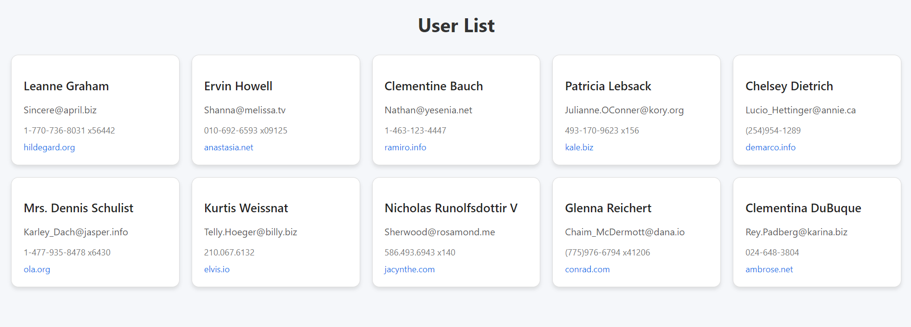

# 🚀 API Checkpoint – React User List

Ce projet est un petit exercice pour pratiquer **React** avec une API externe.  
On utilise [JSONPlaceholder](https://jsonplaceholder.typicode.com/users) pour afficher une liste d’utilisateurs.  

---

## ✨ Fonctionnalités
✅ Créé avec **create-react-app**  
✅ Récupération des données via **Axios**  
✅ Affichage des utilisateurs dans une **liste stylée**  
✅ Composants React avec **useState** et **useEffect**  
✅ Styles avec **CSS personnalisé** (UserList.css)  

---

## 🖼️ Résultat

Voici un aperçu du rendu final de l’application :  



---

## 📂 Structure du projet

```bash
api-checkpoint/
├── src/
│ ├── App.js
│ ├── UserList.js
│ ├── UserList.css
│ ├── index.js
│ └── ...
├── public/
│ └── result.png # Capture d'écran de l'app
├── package.json
└── README.md
```


---

## ⚡ Installation & Lancement

1. Clone le projet :
```bash
   git clone https://github.com/ton-repo/api-checkpoint.git
   cd api-checkpoint
```
2. Installe les dépendances :
```bash 
    npm install
```
3. Lance l’application :
```bash 
    npm start
```

4. Ouvre http://localhost:3000 dans ton navigateur 🌐

## 🛠️ Technologies utilisées

⚛️ React

📡 Axios

🎨 CSS3

## 🎯 Objectif pédagogique

Comprendre comment consommer une API avec React

Manipuler useState et useEffect

Afficher et styler une liste d’éléments

## 👩‍💻 Auteur

Samah Saidi - Développeur Data Science

📧 Contact: samah.saidi@polytechnicien.tn

🔗 GitHub: https://github.com/samah-saidi


<div align="center">

### ⭐ N'oubliez pas de donner une étoile si ce projet vous a aidé !

**Fait avec ❤️ et beaucoup de ☕**

</div>