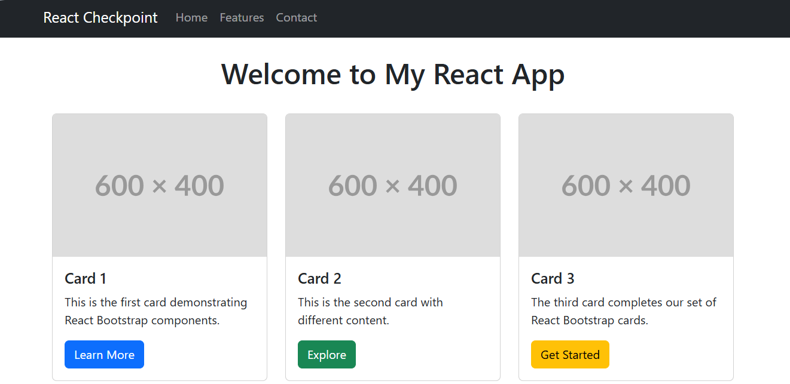

# 🚀 React JS Checkpoint

## 📋 Description du projet
Ce projet est une application React simple réalisée dans le cadre du checkpoint React JS. Elle met en œuvre React et React-Bootstrap pour créer une interface moderne avec une barre de navigation, un titre et trois cartes.

## 🎯 Objectifs
- Découvrir la structure d'un projet React
- Utiliser React-Bootstrap pour styliser l'interface
- Comprendre l'organisation des composants

## 🛠️ Technologies utilisées
- ⚛️ React JS
- 🎨 React-Bootstrap
- 💎 Bootstrap

## 📝 Instructions d'installation

1. **Installer NodeJS et VSCode**
   - [VSCode](https://code.visualstudio.com/)
   - [NodeJS](https://nodejs.org/en)

2. **Créer l'application React**
   ```bash
   npx create-react-app react-checkpoint
   cd react-checkpoint
   ```

3. **Nettoyer le dossier `src`**
   - Supprimer tous les fichiers sauf `index.js` et `reportWebVitals.js`

4. **Créer le composant principal `App.js`**
   - Importer React et React-Bootstrap
   - Utiliser un fragment React et une div avec la classe `App`
   - Ajouter une Navbar, un heading et 3 cards avec React-Bootstrap

5. **Installer React-Bootstrap**
   ```bash
   npm install react-bootstrap bootstrap
   ```

6. **Importer le CSS Bootstrap**
   - Dans `index.js` :
     ```js
     import 'bootstrap/dist/css/bootstrap.min.css';
     ```

7. **Lancer le projet**
   ```bash
   npm start
   ```


## 🗂️ Structure des fichiers
- `src/App.js` : Composant principal avec la Navbar, le heading et les cards
- `src/index.js` : Point d'entrée, import du CSS Bootstrap

## 🔗 Liens utiles
- [Documentation React](https://react.dev/)
- [Documentation React-Bootstrap](https://react-bootstrap.github.io/)
- [Documentation Bootstrap](https://getbootstrap.com/)

## 📸 Capture d'écran


---

## 👩‍💻 Auteur

Samah Saidi - Développeur Data Science

📧 Contact: samah.saidi@polytechnicien.tn

🔗 GitHub: https://github.com/samah-saidi
