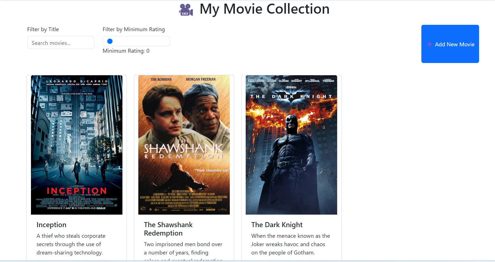
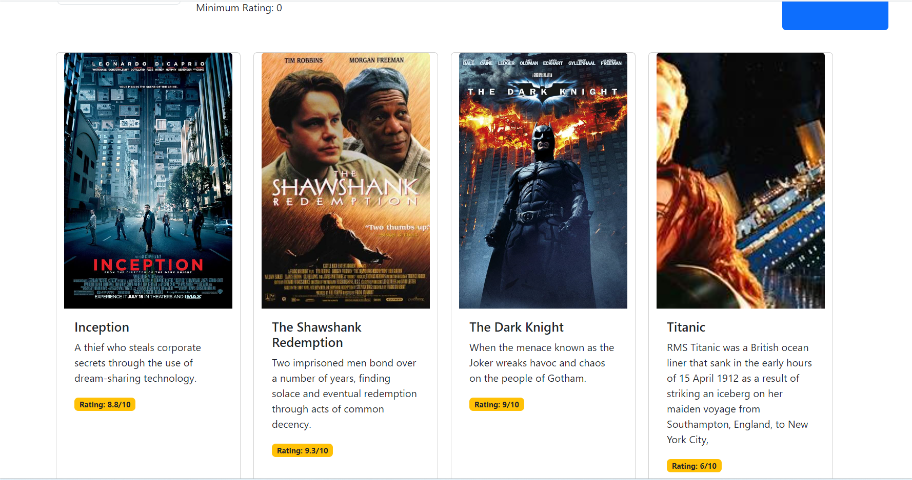
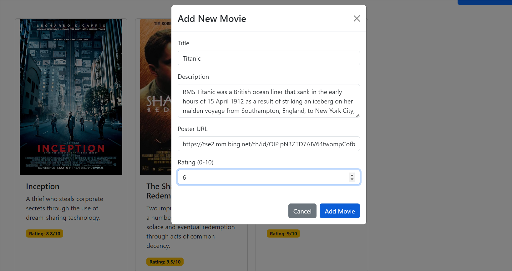
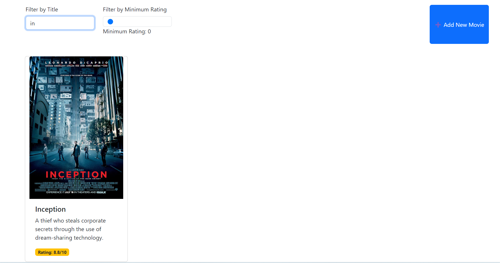
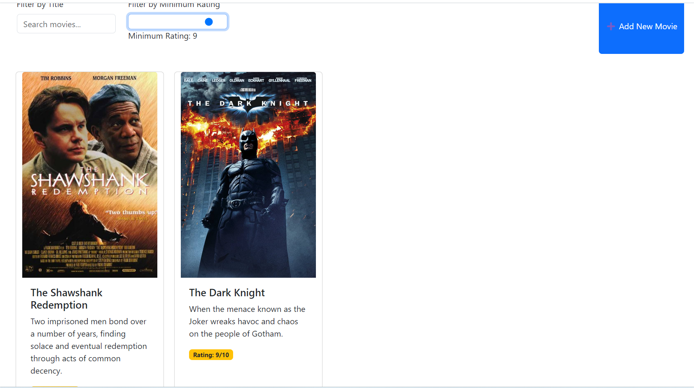

# 🎬 Movie App with React Hooks - Checkpoint Solution
Here's a complete implementation of the Movie App using React Hooks as per your checkpoint requirements:



## 📸 Screenshots

### 🖼️ Interface Principale


### ✨ Ajout de Film


### 🔍 Filtrage par Titre


### ⭐ Filtrage par Note


## ✨ Features

🎥 Display movie cards with beautiful UI

🔍 Filter movies by title and rating

➕ Add new movies via modal form

⚛️ Full React Hooks implementation

🌈 Responsive design with React Bootstrap

🛡️ PropTypes validation for all components

## 🛠️ Installation

1. Clone the repository

```bash
git clone https://github.com/samah-saidi/Formation-Software-Developper-GMC/tree/main/react-hooks-checkpoint
cd movie-app
```

2. Install dependencies

```bash
npm install
```

3. Start the development server

```bash
npm start
```

4. Start the development server

```bash
http://localhost:3000
```
## Project Structure

```bash
src/
├── components/
│   ├── MovieCard.js
│   ├── MovieList.js
│   └── Filter.js
├── App.js
└── index.js
```
## 🧩 Components

#### MovieCard

Displays individual movie information

Shows poster, title, description and rating

Responsive card design

#### MovieList
Renders grid of movie cards

Handles the display of filtered movies

#### Filter
Title search functionality

Rating filter with slider

Real-time filtering

#### AddMovie

Modal form for new movies

Input validation

Image URL preview


## 👩‍💻 Auteur

Samah Saidi - Développeur Data Science

📧 Contact: samah.saidi@polytechnicien.tn

🔗 GitHub: https://github.com/samah-saidi