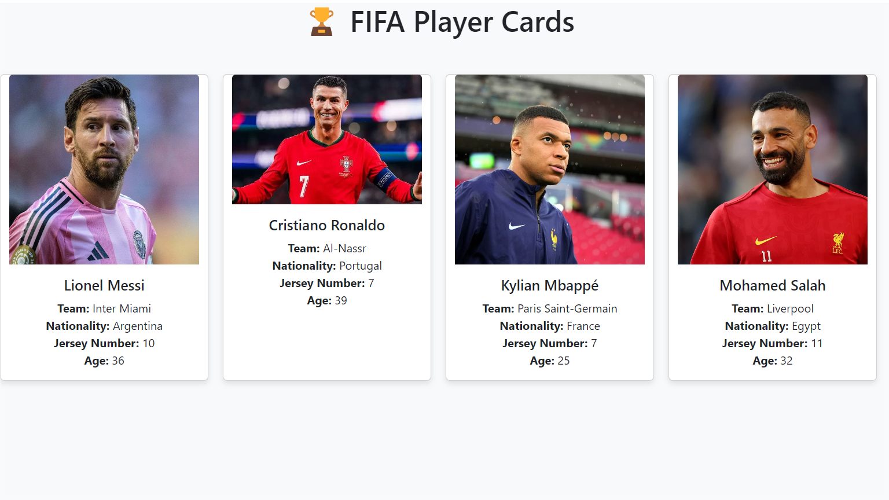

# ⚽ FIFA Player Cards React App 🏆



Un projet React qui affiche des cartes de joueurs FIFA avec leurs informations clés, créé avec React Bootstrap.

## ✨ Fonctionnalités

- 🃏 Cartes de joueurs stylisées
- 🌍 Informations détaillées (nom, équipe, nationalité, etc.)
- 🔢 Validation des props avec PropTypes
- 🖼️ Gestion des images avec fallback
- 🎨 Styles inline avec effets hover

## 🛠️ Installation

1. Clonez le dépôt :
```bash
    git clone https://github.com/samah-saidi/Formation-Software-Developper-GMC/tree/main/react-props-checkpoint
```
2. Installez les dépendances :

```bash
npm install
```

3. Lancez l'application :

```bash
npm start
```

## 📦 Dépendances
react

react-bootstrap

bootstrap

prop-types

## 📸 Résultat attendu

L'application doit afficher 4 cartes de joueurs comme montré dans l'image result.png ci-dessus.


## 🔧 Personnalisation

Pour modifier les joueurs :

Éditez le fichier src/data/players.js

Ajoutez/modifiez les objets joueurs

Sauvegardez et l'application se mettra à jour automatiquement

## 👩‍💻 Auteur

Samah Saidi - Développeur Data Science

📧 Contact: samah.saidi@polytechnicien.tn

🔗 GitHub: https://github.com/samah-saidi
