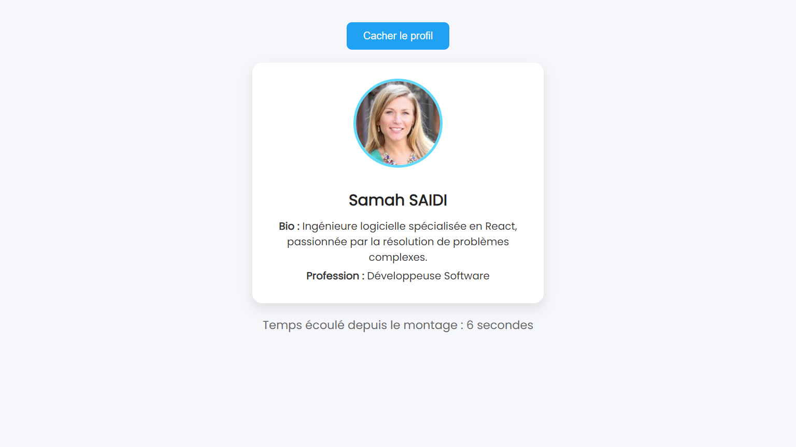

# 🚀 React State Checkpoint

Ce projet est réalisé dans le cadre du checkpoint **"React State"** de la formation **GoMyCode**.  
Il met en œuvre les concepts clés de **React (Class Components, State, Lifecycle)**.

---

## 🎯 Objectifs du projet

- ✅ Créer un composant React basé sur une **classe**
- ✅ Définir un **état (state)** contenant un objet `Person`
- ✅ Ajouter un **bouton** pour afficher / cacher le profil
- ✅ Afficher le **temps écoulé ⏱️** depuis le montage du composant (via `componentDidMount`)
- ✅ Appliquer un **style moderne** avec CSS

---

## 👤 Profil affiché

- **👩 Nom** : Samah SAIDI  
- **🧠 Bio** : Ingénieure logicielle spécialisée en React, passionnée par la résolution de problèmes complexes.  
- **💼 Profession** : Développeuse Software  
- **🖼️ Photo** :  
  

---

## 📦 Démarrage du projet

```bash
    git clone <repo-url>
    cd react-state-checkpoint
    npm install
    npm start
```

🛠️ Fichiers importants
src/App.js
Contient le composant App en classe, la logique d'état, le toggle d'affichage et le compteur.

src/App.css
Gère le style de l'application, avec un design moderne pour la carte profil, le bouton, et le compteur.

📸 Aperçu

 

🧠 Concepts utilisés

class Component

this.state & this.setState

componentDidMount, componentWillUnmount

setInterval, clearInterval

JSX conditionnel ({shows && (...)})

## 👩‍💻 Auteur

Samah Saidi - Développeur Data Science

📧 Contact: samah.saidi@polytechnicien.tn

🔗 GitHub: https://github.com/samah-saidi
